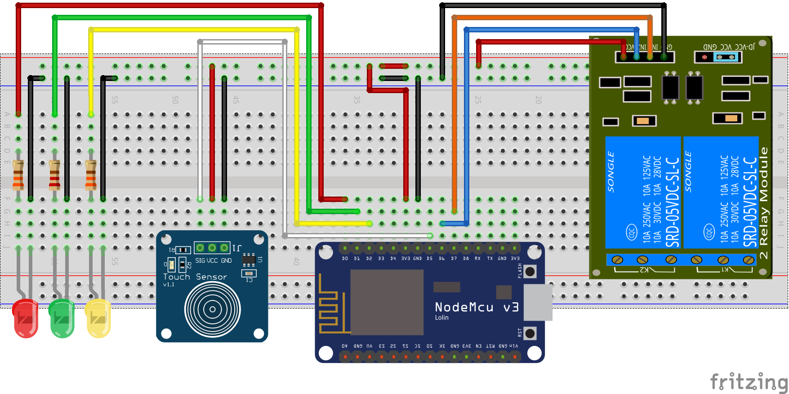
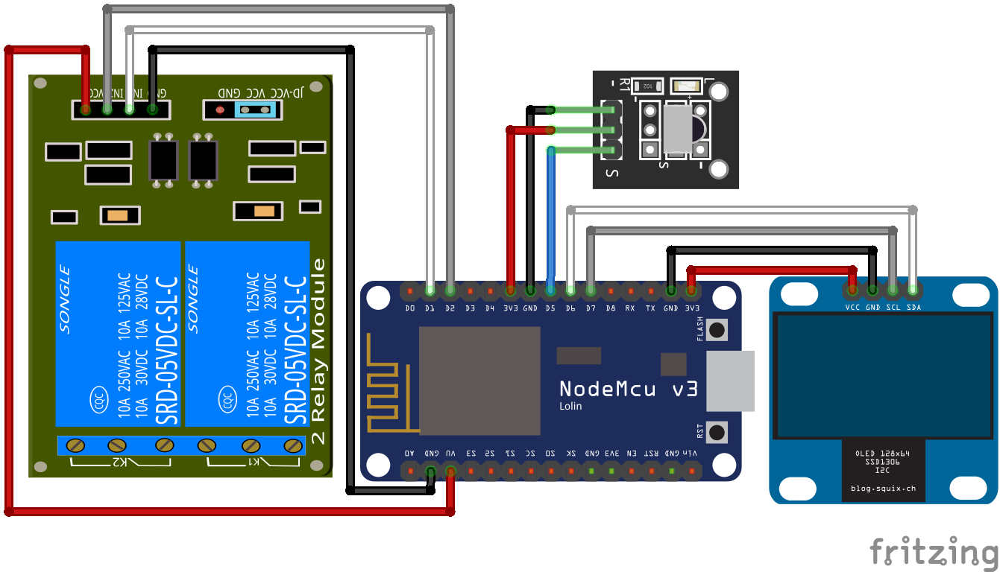

# 智能开关

Wifi 遥控开关，最多支持 9 路开关，高低电平触发均可。建议采用 2 路低电平触发继电器，避免外接额外处理电路。

可以支持外红遥控，与 0.96 寸 I2C OLED 显示屏。

## 硬件

建议物料清单：

- NodeMCU v3 开发板（板载 D4 Led、D3 Flash 与 Reset 按键）
- 2 通道低电平触发继电器（可选高电平触发，1 路、4 路、双 4 路）
- HX1838 红外接收头模块（需 CarMP3 21 键遥控器，NEC 编码）
- 母对母杜邦线 7 条

附加物料清单：

- 0.96 寸 128x64 SSD1306 I2C OLED 显示屏
- 母对母杜邦线 4 条

说明：

- NodeMCU v3 开发板 ESP6288 12F 板载 Led 接在 D4(GPIO2)，低电平触发
- NodeMCU v3 开发板板载 Flash 按键接在 D3(GPIO0)，低电平触发
- NodeMCU v3 开发板板载 Reset 按键接在 RST，低电平触发
- 默认的 2 路继电器，IN1 和 IN2 依次接在 D1(GPIO5) 和 D2(GPIO4)
- 默认开启的调试串口 RX 在 D9(GPIO3)（未用），TX 在 D10(GPIO1)
- 可选的红外接收头数据 D0 接在 D5(GPIO14)
- 可选的 I2C 显示屏 SDA 接在 D6(GPIO12)，SCL 接在 D7(GPIO13)
- 9 路继电器顺序依次为：D1、D2、D5、D6、D7、D0、D8、D9、D10，其中 D5、D6、D7、D10 被占用将被跳过

## 软件

- `#define SWITCH_COUNT 2` 继电器数量
- `#define SWITCH_TRIG_LOW` 继电器低电平触发，注释掉就是高电平触发
- `#define SWITCH_IR` 开启红外，注释掉就是关闭红外
- `#define SWITCH_OLED` 开启显示屏，注释掉就是关闭显示屏
- `#define SWITCH_DEBUG` 开启 TX0 调试输出，注释掉就是关闭调试输出
- `#define SWITCH_NAME "SWITCH_"` mDNS 名称前缀，后面会加上 Wifi Mac 地址后三位，用于识别设备
- `#define SWITCH_SERV "http_switch"` mDNS 服务名，用于局域网发现设备

## 网络接口

参见[网络接口文档](network.md)。

### 板载按键

- 板载 Reset 按键硬件重启
- 板载 Flash 按键清除配网重启

### 板载 LED

LED 状态 | 说明
:-------:|----
快闪 2 下，亮 0.5 秒 | 正在联网
常亮 | 联网正常
慢闪，亮 0.5 秒，灭 1.5 秒 | 联网错误
持续快闪 | 配网状态
闪 1 下 | 开关动作（只在网络正常时反馈）

### 21 键遥控器（NEC 编码）

- `1`…`8` 键对应 1…8 路继电器切换状态
- `0` 键全关所有继电器
- `100+` 键全开所有继电器
- `EQ` 键对应板载 Flash 键清除配网重启

 按键  | 数值     | 按键  | 数值     | 按键  | 数值
:-----:|---------:|:-----:|---------:|:-----:|---------:
 `CH-` | 0xFFA25D | `CH`  | 0xFF629D | `CH+` | 0xFFE21D
 ⏮   | 0xFF22DD | ⏭   | 0xFF02FD | ⏯   | 0xFFC23D
 `-`   | 0xFFE01F | `+`   | 0xFFA857 | `EQ`  | 0xFF906F
 `0`   | 0xFF6897 | `100+`| 0xFF9867 | `200+`| 0xFFB04F
 `1`   | 0xFF30CF | `2`   | 0xFF18E7 | `3`   | 0xFF7A85
 `4`   | 0xFF10EF | `5`   | 0xFF38C7 | `6`   | 0xFF5AA5
 `7`   | 0xFF42BD | `8`   | 0xFF4AB5 | `9`   | 0xFF52AD

## 参考

- [8 Relay Control With NodeMCU and IR Receiver](http://www.instructables.com/id/8-Relay-Control-With-NodeMCU-and-IR-Receiver-Using/)
- [Using ESP8266 GPIO0/GPIO2/GPIO15](https://www.forward.com.au/pfod/ESP8266/GPIOpins/index.html)
